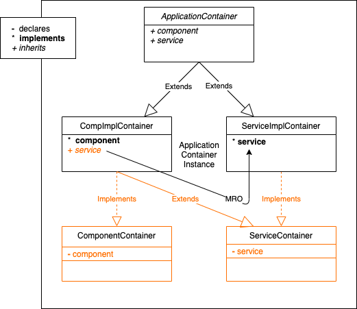

# Dependency injection pattern for Python

Blueprint for a Dependency Injection (DI) pattern in Python based on container mixins. 

## Principle

The pattern models the dependency order in object instantiation by an invocation chain of provider
methods. Provider methods are resolved in a top level container that is composed from individual
containers that are provided by the implementation modules as mixins.

The following diagram visualizes this pattern with a `component` module who's implementation is
provided by the `ComponentImplContainer` and depends on a `service`, provided by the
`ServiceImplContainer`. The top level `ApplicationContainer` is composed of both of the
implementation containers. Different implementations of the `service` can be injected into the
`component` by replacing the `ServiceImplContainer` in the `ApplicationContainer` with any other
container that provides a `service`. Application code uses the `ApplicationContainer` as entry
point to retrieve a `component` (or `service`) instance. 

The red parts in the diagram and the respective `api` modules in code are not needed in Pyhton.
They have no functional impact and can be (fully or partially) left out. They serve only the
purpose of clarity.